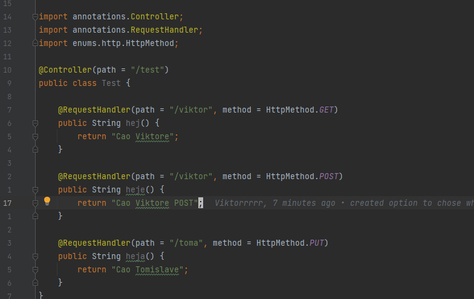

# JAVA FRAME

### Java framework made for fun and learning.

Everything in JavaFrame is custom and made by my. From parsing request to returning results.

Still in development, but very fast growing project. At this moment available features are:

* Parsing json
* Parsing http
* Returning http
* Adding controller annotations and method annotations
* Invoking methods

Things that need to be developed:

* Working with Database
* Security

This is example how you should use framework:

